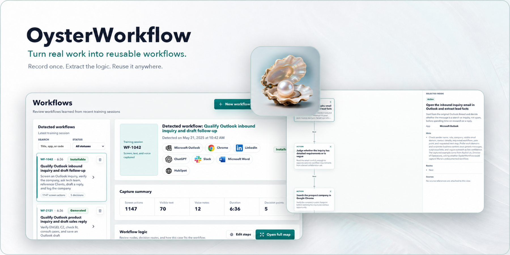
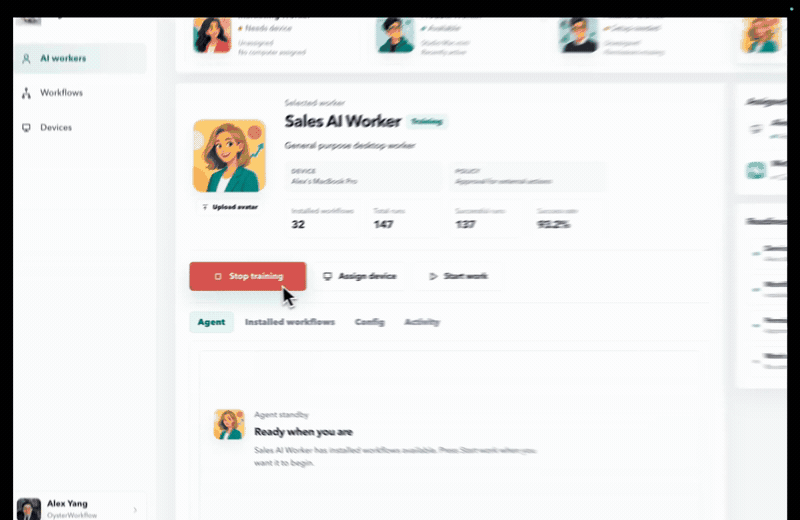
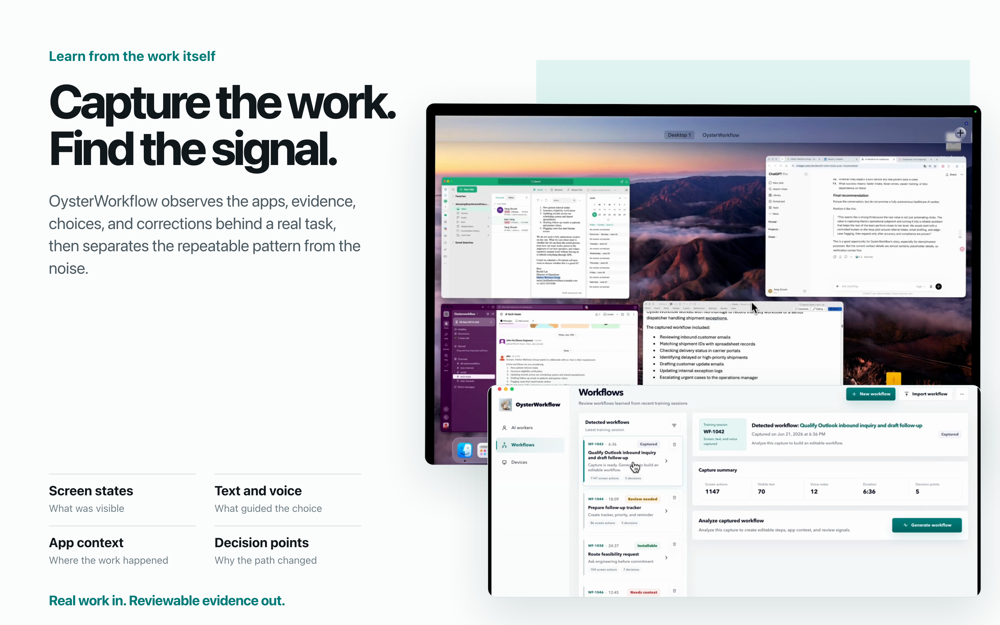
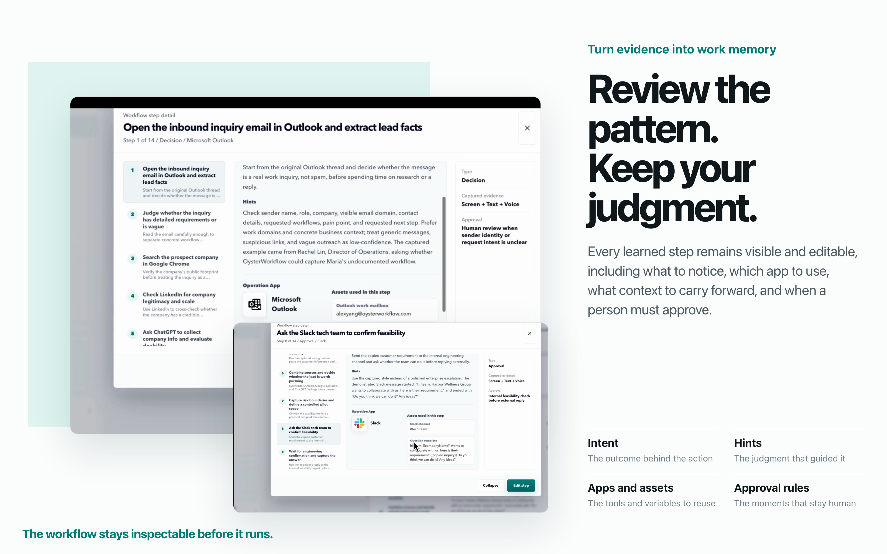

<div align="center"><a id="readme-top"></a>

<a href="https://oysterworkflow.com/">
  
</a>

# OysterWorkflow

**Teach AI how your work actually gets done.**

OysterWorkflow is an open-source work-experience layer for your AI agent, as well as a powerful automation tool for your daily work. It runs alongside you, observing on-screen information, mouse clicks, and keyboard input, while also receiving your voice instructions. Oyster use behavioral psychology model to infer your intent and decision-making process, automatically captures your workflows, and generates self-evolving automation harnesses for your agents. Oysterworkflow works with Codex, Claude, and other AI agents.

[**English**](./README.md) &nbsp;&nbsp;|&nbsp;&nbsp; [简体中文](https://github.com/ShuxinYang111/oysterworkflow/blob/main/README.zh-CN.md) &nbsp;&nbsp;|&nbsp;&nbsp; [Official Site](https://oysterworkflow.com/) &nbsp;&nbsp;|&nbsp;&nbsp; [Download](https://github.com/ShuxinYang111/oysterworkflow/releases/latest) &nbsp;&nbsp;|&nbsp;&nbsp; [Roadmap](https://github.com/ShuxinYang111/oysterworkflow/blob/main/ROADMAP.md) &nbsp;&nbsp;|&nbsp;&nbsp; [Feedback](https://github.com/ShuxinYang111/oysterworkflow/issues)

<!-- PROJECT SHIELDS -->

[![][release-shield]][release-link]
[![][downloads-shield]][release-link]
[![][platform-shield]][release-link]<br/>
[![][contributors-shield]][contributors-link]
[![][forks-shield]][forks-link]
[![][stars-shield]][stars-link]
[![][issues-shield]][issues-link]<br/>
[![][license-shield]][license-link]

**Share OysterWorkflow**

[![][share-x-shield]][share-x-link]
[![][share-reddit-shield]][share-reddit-link]
[![][share-linkedin-shield]][share-linkedin-link]

</div>

## Powerful AI still needs your workflow and judgment

AI can reason, but it does not automatically know which signal matters, when to branch, how to recover, or what "done" means in your work.

Most real computer work is more than instructions. It is a pattern of noticing, deciding, trying, fixing, verifying, and finishing. OysterWorkflow captures what people observe, how they react, and how they complete the task, then turns that work memory into a reviewable workflow an agent can reuse.

## From real work to reusable agent experience

Raw work is messy. OysterWorkflow extracts the pattern.

1. **Capture real work.** Record screen states, visible text, mouse and keyboard actions, app context, and optional voice coaching while you work normally.
2. **Learn the pattern.** Extract goals, decision branches, preferences, exceptions, recovery moves, verification checks, and completion conditions.
3. **Run the workflow.** Turn the evidence into a reviewable, revisioned experience layer that Codex or another compatible agent can follow.

### Watch real work become reusable agent experience

<p align="center">
  <a href="https://github.com/user-attachments/assets/261f1fd1-933d-4989-83c0-4757012d9097">
    
  </a>
</p>

## See what OysterWorkflow learns

OysterWorkflow does not learn a macro. It learns what to notice, how to decide, which context to carry forward, and when a person should review the next move.

<p align="center">
  
</p>

<br />

<p align="center">
  
</p>

## Run an OysterWorkflow in Codex

The Codex plugin connects Codex to the OysterWorkflow Runtime on the same Mac. OysterWorkflow owns the workflow graph, revision, transitions, retry limits, and durable run state. Codex performs the real actions with the apps and tools installed and authorized in Codex.

You need both OysterWorkflow and Codex. Every app required by the workflow must also be available to Codex.

```bash
codex plugin marketplace add ShuxinYang111/oysterworkflow
codex plugin add oysterworkflow@oysterworkflow
```

Start a new Codex task and try:

```text
Use OysterWorkflow to run "Screen sales inquiries and prepare replies"
```

The beta connects to the local MCP endpoint at `http://127.0.0.1:3034/api/codex/mcp`, so OysterWorkflow must remain running during execution.

## Download and start

### macOS Apple Silicon

Download the latest macOS installer from [Releases](https://github.com/ShuxinYang111/oysterworkflow/releases/latest).

1. Open the DMG and drag `OysterWorkflow.app` into `Applications`.
2. Launch OysterWorkflow and grant the requested permissions.
3. Record one real workflow, review the graph, and choose where to run it.

Screen Recording, Accessibility, and Input Monitoring permissions support desktop capture. Microphone permission is only needed for voice coaching.

### Windows x64

[Download the Windows 0.1.0 build](https://github.com/ShuxinYang111/oysterworkflow/releases/download/v0.1.0/OysterWorkflow-Setup-0.1.0.exe).

The Windows build is an earlier release. The Codex plugin and the newest workflow graph experience currently require macOS Apple Silicon.

## Open core and desktop app licensing

The OysterWorkflow source is available in this repository under a mixed-license model:

- The open core is licensed under [Apache License 2.0](./LICENSE). Unless a path is explicitly listed as PolyForm-covered, original OysterWorkflow code in this repository is Apache-2.0.
- Desktop-product code and assets listed in [LICENSING.md](./LICENSING.md) are licensed under [PolyForm Noncommercial 1.0.0](./legal/PolyForm-Noncommercial-1.0.0.md). Noncommercial use is permitted under those terms; commercial use requires a separate license from OysterWorkflow.
- Bundled third-party components keep their own license terms. See [THIRD-PARTY-NOTICES.md](./THIRD-PARTY-NOTICES.md) for details.

The root license detected by GitHub is Apache-2.0. Always check the nearest `LICENSING.md` before reusing files from desktop-product directories.

## Feedback and contributing

- [Report an issue](https://github.com/ShuxinYang111/oysterworkflow/issues)
- [Read the roadmap](https://github.com/ShuxinYang111/oysterworkflow/blob/main/ROADMAP.md)
- [Read the contribution guide](https://github.com/ShuxinYang111/oysterworkflow/blob/main/CONTRIBUTING.md)
- [Review third-party notices](https://github.com/ShuxinYang111/oysterworkflow/blob/main/THIRD-PARTY-NOTICES.md)

Bug reports, workflow-generation feedback, documentation improvements, integration ideas, and pull requests are welcome. Do not include credentials, customer data, private URLs, or unredacted workflow evidence in public issues.

<!-- LINK DEFINITIONS -->

[release-link]: https://github.com/ShuxinYang111/oysterworkflow/releases/latest
[contributors-link]: https://github.com/ShuxinYang111/oysterworkflow/graphs/contributors
[forks-link]: https://github.com/ShuxinYang111/oysterworkflow/network/members
[stars-link]: https://github.com/ShuxinYang111/oysterworkflow/stargazers
[issues-link]: https://github.com/ShuxinYang111/oysterworkflow/issues
[license-link]: https://github.com/ShuxinYang111/oysterworkflow/blob/main/LICENSE
[release-shield]: https://img.shields.io/github/v/release/ShuxinYang111/oysterworkflow?color=007B78&labelColor=0F172A&logo=github&logoColor=white&style=flat-square
[downloads-shield]: https://img.shields.io/github/downloads/ShuxinYang111/oysterworkflow/total?color=5DD5D0&label=downloads&labelColor=0F172A&style=flat-square
[platform-shield]: https://img.shields.io/badge/platform-macOS%20Apple%20Silicon-DDE7E7?labelColor=0F172A&logo=apple&logoColor=white&style=flat-square
[contributors-shield]: https://img.shields.io/github/contributors/ShuxinYang111/oysterworkflow?color=B9F227&labelColor=0F172A&style=flat-square
[forks-shield]: https://img.shields.io/github/forks/ShuxinYang111/oysterworkflow?color=8AE8FF&labelColor=0F172A&style=flat-square
[stars-shield]: https://img.shields.io/github/stars/ShuxinYang111/oysterworkflow?color=FFCB47&labelColor=0F172A&style=flat-square
[issues-shield]: https://img.shields.io/github/issues/ShuxinYang111/oysterworkflow?color=FF80EB&labelColor=0F172A&style=flat-square
[license-shield]: https://img.shields.io/badge/license-Apache--2.0-F4F7F7?labelColor=0F172A&logo=apache&logoColor=white&style=flat-square
[share-x-link]: https://x.com/intent/tweet?text=Turn%20real%20work%20into%20reusable%20workflows%20with%20OysterWorkflow.&url=https%3A%2F%2Fgithub.com%2FShuxinYang111%2Foysterworkflow
[share-reddit-link]: https://www.reddit.com/submit?url=https%3A%2F%2Fgithub.com%2FShuxinYang111%2Foysterworkflow&title=OysterWorkflow%20-%20Turn%20real%20work%20into%20reusable%20workflows
[share-linkedin-link]: https://www.linkedin.com/sharing/share-offsite/?url=https%3A%2F%2Fgithub.com%2FShuxinYang111%2Foysterworkflow
[share-x-shield]: https://img.shields.io/badge/share%20on-X-0F172A?logo=x&logoColor=white&style=flat-square
[share-reddit-shield]: https://img.shields.io/badge/share%20on-Reddit-0F172A?logo=reddit&logoColor=white&style=flat-square
[share-linkedin-shield]: https://img.shields.io/badge/share%20on-LinkedIn-0F172A?logo=linkedin&logoColor=white&style=flat-square
