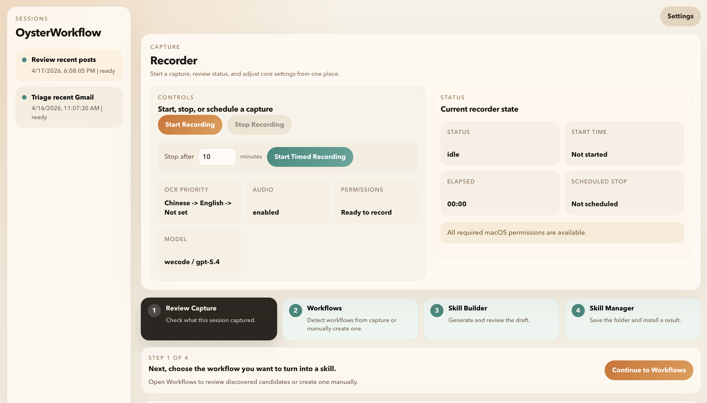
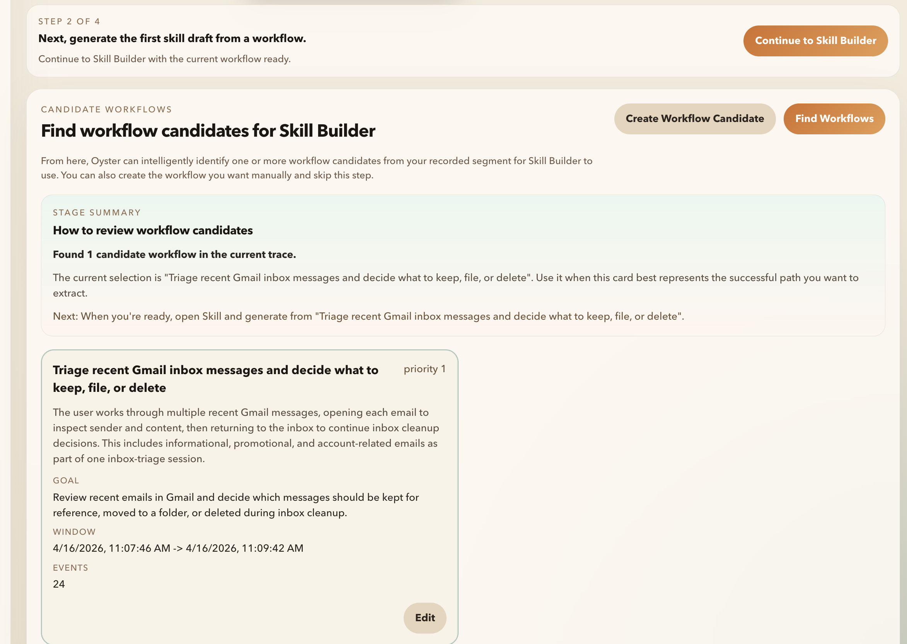
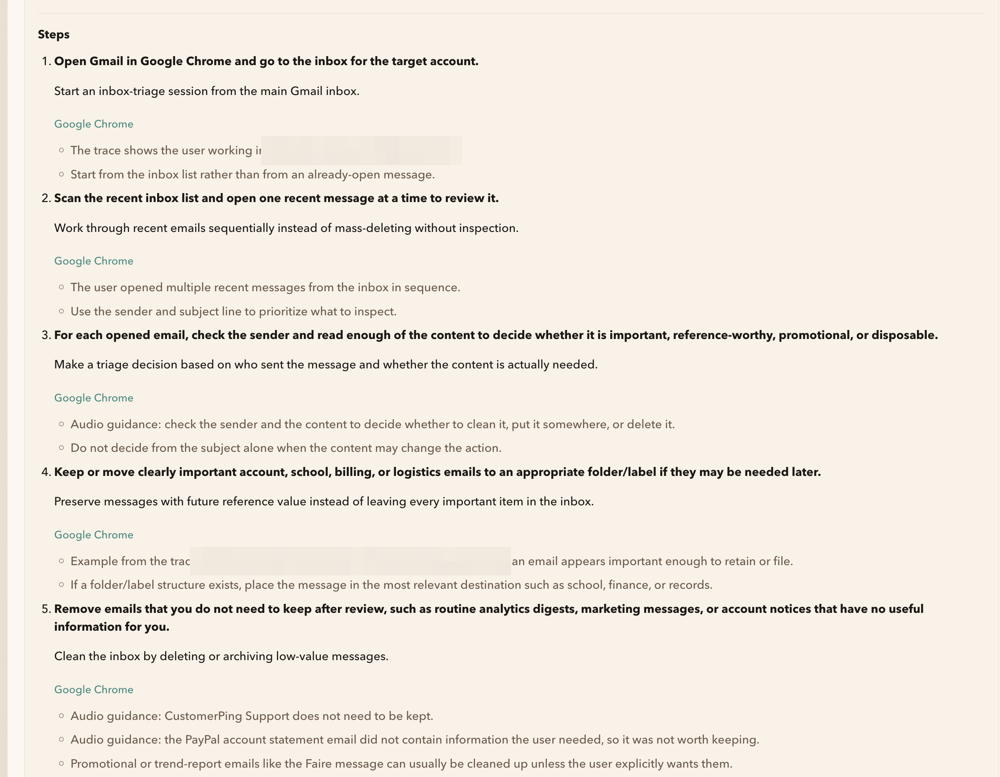
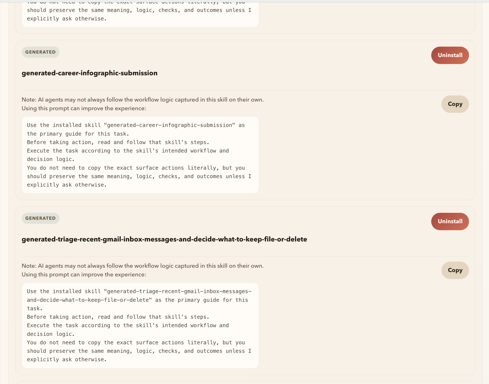

# OysterWorkflow

[English](./README.md) | [简体中文](./README.zh-CN.md)

在 macOS 上，将录制下来的真实工作流转化为可复用的skill。

[下载最新版](https://github.com/ShuxinYang111/oysterworkflow/releases/latest) | [发布记录](https://github.com/ShuxinYang111/oysterworkflow/releases) | [反馈问题](https://github.com/ShuxinYang111/oysterworkflow/issues)

OysterWorkflow 是一款 macOS 桌面应用，用于采集真实工作流证据、审查候选工作流、生成可复用的 skill artifacts，并将生成结果安装到 OpenClaw 可发现的 skill 目录中。

这个公开仓库是 OysterWorkflow 的发布主页，主要用于下载、发布记录、截图、文档和 issue tracking。OysterWorkflow 的源码目前仍为私有。

## 截图

### 采集与录制状态

在一个界面中开始、停止或安排采集任务，同时查看 OCR 语言优先级、音频采集、录制器状态和 macOS 权限准备情况。



### 工作流候选发现

查看从录制 session 中识别出的候选工作流、阶段摘要，并选择继续使用生成的候选工作流或手动创建。



### Skill 草稿审查

在安装结果之前，检查生成的 OpenClaw skill steps 和 evidence notes。截图中的敏感个人信息和账号相关细节已做脱敏处理。



### Skill 管理与安装提示

管理已安装的 skills，复制推荐执行提示词，并在不再需要时卸载生成的 skills。



## 为什么使用它

- 从屏幕活动、OCR、UI events 和可选语音讲解中采集工作流证据
- 将一次录制 session 转化为候选的可复用工作流
- 在导出或安装前审查生成的 skill artifacts
- 将完成的 skills 直接安装到 OpenClaw skill 目录

## 工作方式

1. 在桌面应用中录制一个工作流。
2. 审查采集到的 session，并选择你想沉淀的工作流。
3. 生成可复用的 OpenClaw skill artifact。
4. 将结果安装到你的 skill 目录，并在之后复用。

## 下载

从 [Releases](https://github.com/ShuxinYang111/oysterworkflow/releases/latest) 下载最新版 macOS 构建。

当前发布文件：

- `OysterWorkflow-0.1.0-arm64.dmg`

SHA-256：

```text
711fe49c3abeb66e109c1ab78476b09978d3c83c042b922a58a6affa46d16187
```

## 系统要求

- macOS
- Apple Silicon Mac (`arm64`)

## 安装说明

1. 从 latest release 下载 `OysterWorkflow-0.1.0-arm64.dmg`。
2. 打开 `.dmg`，将 `OysterWorkflow.app` 拖入 `Applications`。
3. 从 `Applications` 启动 OysterWorkflow。
4. 按提示授予必要的 macOS 权限。
5. 如果刚刚开启了录制相关权限，建议退出并重新打开应用一次，再开始录制。

因为 OysterWorkflow 需要采集工作流证据，macOS 可能会请求以下权限：

- Screen Recording
- Accessibility
- Input Monitoring
- Microphone，当启用语音讲解时需要

## 这个公开仓库包含什么

- macOS release 下载
- release notes
- 截图与产品文档
- 安装和使用问题的 issue tracking

它不包含 OysterWorkflow 的私有源码。

## 许可

公开发布版本使用 [PolyForm Noncommercial 1.0.0](./LICENSE) 许可。

简单来说：

- 你可以下载并将公开发布版本用于非商业用途
- 你不会获得私有源码的使用权
- 公开发布条款不授权商业使用

请阅读 [LICENSE-SUMMARY.md](./LICENSE-SUMMARY.md) 查看简明许可摘要。

如需商业授权，请联系：`shuxin.y.97@gmail.com`

## 反馈

请通过 [GitHub Issues](https://github.com/ShuxinYang111/oysterworkflow/issues) 反馈 bug、安装问题和 workflow generation 相关问题。
