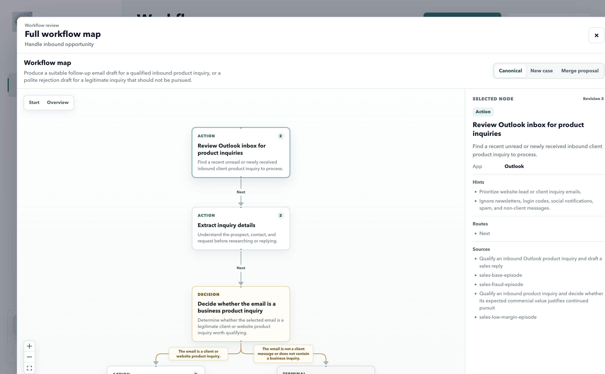

<p align="center">
  
</p>

<h1 align="center">OysterWorkflow</h1>

<p align="center"><strong>让你的日常工作教会 AI。</strong></p>

<p align="center">记录真实电脑工作，提炼背后的流程与判断，再把这份经验交给你的 AI Agent 执行。</p>

<p align="center">
  <a href="https://github.com/ShuxinYang111/oysterworkflow/releases/download/v0.2.0/OysterWorkflow-0.2.0-arm64.dmg"><strong>下载 macOS 版</strong></a>
  &nbsp;&nbsp;|&nbsp;&nbsp;
  <a href="https://oysterworkflow.com/">官网</a>
  &nbsp;&nbsp;|&nbsp;&nbsp;
  <a href="./README.md">English</a>
</p>



## 强大的 AI 仍然需要你的流程与判断

AI 可以推理，但它不会自动知道哪些信号重要、什么时候需要分支、失败后怎样恢复，也不知道你的工作以什么标准才算完成。

OysterWorkflow 从真实电脑工作中学习这些模式。你只需要在熟悉的应用里完成任务，审查系统提炼出的工作流图，再把固定版本交给 Agent。

## 从真实工作到可复用的 Agent 经验

1. **记录真实工作。** 在正常工作的同时，采集屏幕状态、可见文字、鼠标与键盘动作、应用上下文，以及可选的语音讲解。
2. **学习工作模式。** 提炼目标、判断分支、偏好、例外、重试逻辑、验证条件和完成条件。
3. **执行工作流。** 将证据整理成可审查、带版本的工作流图，交给 Oyster AI Worker、Codex 或其它兼容 Agent 执行。

## 看见 OysterWorkflow 学到了什么

<table>
  <tr>
    <td width="50%">
      
      <br />
      <strong>记录工作</strong><br />
      采集屏幕、可见文字、输入、应用上下文和可选语音讲解。
    </td>
    <td width="50%">
      
      <br />
      <strong>选择模式</strong><br />
      从一次完整但嘈杂的录制中，审查系统识别出的关键工作流。
    </td>
  </tr>
</table>

最终保留下来的不只是一份步骤清单，还包括：

- Agent 应该关注或忽略哪些上下文
- 哪些动作和判断会让任务继续推进
- 页面变化、动作失败或状态模糊时应该怎样恢复
- 怎样验证结果，以及何时可以确认任务完成

## 在 Codex 中执行 OysterWorkflow 工作流

Codex 插件会把 Codex 连接到同一台 Mac 上运行的 OysterWorkflow Runtime。OysterWorkflow 管理工作流图、版本、状态转换、重试上限和持久运行状态。Codex 使用自己已经安装并授权的应用与工具完成真实操作。

你需要同时安装 OysterWorkflow 和 Codex。工作流依赖的每一个应用，也必须能被 Codex 访问。

```bash
codex plugin marketplace add ShuxinYang111/oysterworkflow
codex plugin add oysterworkflow@oysterworkflow
```

新建一个 Codex 任务并输入：

```text
用 OysterWorkflow 执行“筛选销售询盘并准备回复”
```

Beta 版本连接本机 MCP 地址 `http://127.0.0.1:3034/api/codex/mcp`，因此执行期间 OysterWorkflow 必须保持运行。

## 下载并开始使用

### macOS Apple Silicon

当前安装包是 `OysterWorkflow-0.2.0-arm64.dmg`，请使用页面顶部的下载入口。

1. 打开 DMG，将 `OysterWorkflow.app` 拖入 `Applications`。
2. 启动 OysterWorkflow，并按提示授予需要的权限。
3. 录制一个真实工作流，审查工作流图，再选择执行它的 Agent。

Screen Recording、Accessibility 和 Input Monitoring 权限用于桌面采集。只有使用语音讲解时才需要 Microphone 权限。

### Windows x64

**[下载 Windows 0.1.0 版](https://github.com/ShuxinYang111/oysterworkflow/releases/download/v0.1.0/OysterWorkflow-Setup-0.1.0.exe)**

Windows 版是较早的版本。Codex 插件和最新的工作流图体验目前需要 macOS Apple Silicon。

## 开源 Core

[OysterWorkflow Core](https://github.com/ShuxinYang111/oysterworkflow-core) 使用 Apache-2.0 许可证开源，包含 Screenpipe ingest client、trace normalization、deduplication、segmentation、workflow discovery、OpenClaw skill extraction 和生成质量评估。

当前仓库是桌面发行包、文档、截图、Codex 插件与 issue tracking 的公开入口，不包含桌面应用源码。

## 反馈与授权

- [反馈问题](https://github.com/ShuxinYang111/oysterworkflow/issues)
- [查看 Roadmap](./ROADMAP.md)
- [参与反馈](./CONTRIBUTING.md)
- [查看第三方组件声明](./THIRD-PARTY-NOTICES.md)

桌面公开发行版使用 [PolyForm Noncommercial 1.0.0](./LICENSE) 许可证。商业使用需要单独书面授权。你可以阅读[简明许可说明](./LICENSE-SUMMARY.md)，或联系 [shuxin.y.97@gmail.com](mailto:shuxin.y.97@gmail.com)。
